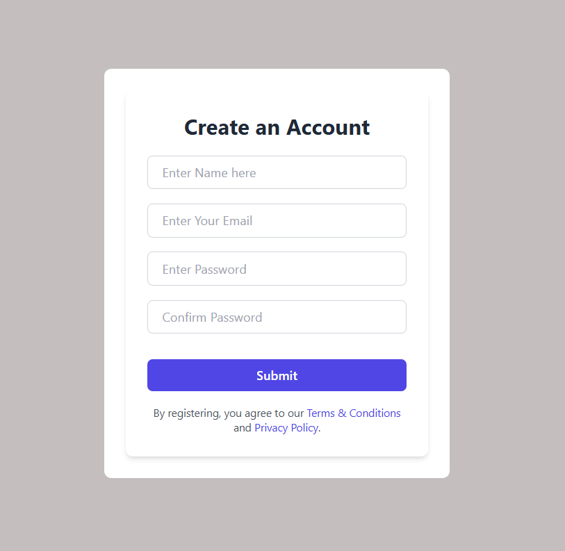

# React User Registration App

A simple React application for user registration with form validation and Tailwind CSS for styling.

## Features

- User registration form with fields for:
  - Full Name
  - Email
  - Password
  - Confirm Password
- Form validation:
  - Password must be at least 8 characters long.
  - Password must contain at least one special character.
  - Password must contain at least one capital letter.
  - Password and Confirm Password must match.
- Success toast notification on successful registration.
- Display a list of registered users.

## Technologies Used

- **React**: A JavaScript library for building user interfaces.
- **Tailwind CSS**: A utility-first CSS framework for rapid UI development.
- **React Toastify**: A library for displaying toast notifications.
- **HTML5**: For structuring the application.
- **JavaScript**: For application logic.

``

